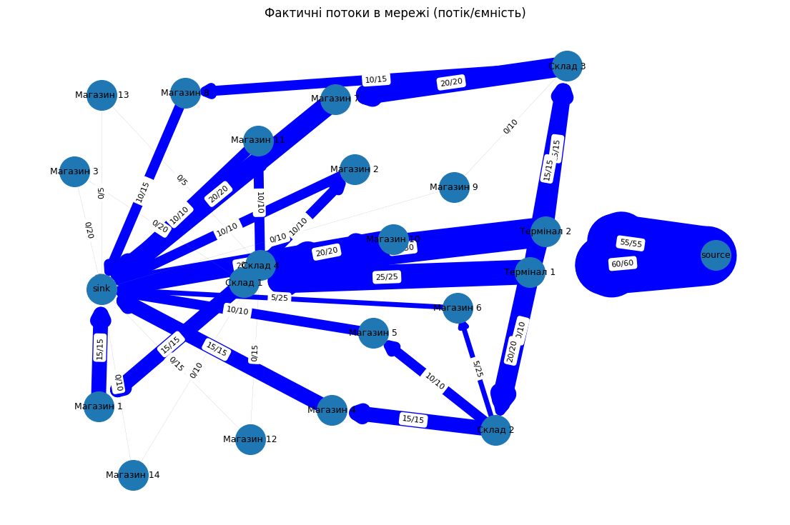

# Просунуті структури для оптимізації та пошуку

## Завдання 1.
### Застосування алгоритму максимального потоку для логістики товарів


Розробіть програму для моделювання мережі потоків для логістики товарів зі складів до магазинів, використовуючи алгоритм максимального потоку. Проведіть аналіз отриманих результатів і порівняйте їх з теоретичними знаннями.


#### Опис завдання

Побудуйте модель графа, що представляє мережу потоків у наступному зображені:


Зв'язки та пропускні здатності у графі мають наступний вигляд:

|Від	    |До	        |Пропускна здатність |
|---------- |---------- |------------------- |
|Термінал 1	|Склад 1	|25                  |
|Термінал 1	|Склад 2	|20                  |
|Термінал 1	|Склад 3	|15                  |
|Термінал 2	|Склад 3	|15                  |
|Термінал 2	|Склад 4	|30                  |
|Термінал 2	|Склад 2	|10                  |
|Склад 1	|Магазин 1	|15                  |
|Склад 1	|Магазин 2	|10                  |
|Склад 1	|Магазин 2	|10                  |
|Склад 1	|Магазин 3	|20                  |
|Склад 2	|Магазин 4	|15                  |
|Склад 2	|Магазин 4	|15                  |
|Склад 2	|Магазин 4	|15                  |
|Склад 2	|Магазин 5	|10                  |
|Склад 2	|Магазин 6	|25                  |
|Склад 3	|Магазин 7	|20                  |
|Склад 3	|Магазин 8	|15                  |
|Склад 3	|Магазин 9	|10                  |
|Склад 4	|Магазин 10	|20                  |
|Склад 4	|Магазин 11	|10                  |
|Склад 4	|Магазин 12	|15                  |
|Склад 4	|Магазин 13	|5                   |
|Склад 4	|Магазин 14	|10                  |


Застосуйте алгоритм максимального потоку для вирішення задачі. 
Напишіть програму, що реалізує алгоритм Едмондса-Карпа, або скористайтеся вже реалізованою версією для знаходження максимального потоку в побудованому графі. Проведіть аналіз отриманого результату. Чи досягнуто оптимального потоку, і що це означає для розглянутої мережі?

Оформіть звіт з розрахунками та поясненнями. Поясніть, які вершини та ребра було вибрано, як вони відповідають реальним елементам логістичної системи. 
Покажіть покроковий розрахунок максимального потоку та пояснити логіку кожного кроку.


#### Технічні умови

1. Використовуйте алгоритм Едмондса-Карпа для реалізації максимального потоку.

2. Побудова графа повинна відповідати наведеній структурі з 20 вершинами та заданими пропускними здатностями.


#### Критерії прийняття

1. Програма коректно виконує розрахунок максимального потоку та повертає точні результати (15 б.).

2. Дані коректно додаються до графа та відповідають наведеній структурі логістичної мережі (15 б.).

3. Пояснення та аналіз зрозумілі та чітко відображають логіку роботи алгоритму (10 б.).

4. Звіт включає аналіз отриманих результатів (10 б.).


Звіт з розрахунками та поясненнями повинен включати таблицю з результатами потоків між терміналами та магазинами наступного вигляду:
|Термінал	  |Магазин	    |Фактичний Потік (одиниць)|
|------------ |------------ |------------------------ |
|Термінал 1	  |Магазин 1	|X                        |
|Термінал 1	  |Магазин 2	|Y                        |
|…	…	…     |             |                         |
|Термінал 2	  |Магазин 14	|Z                        |


У таблиці наведено підсумкові значення потоків між терміналами та магазинами, що були обчислені за допомогою алгоритму Едмондса-Карпа. 
Дані для кожного термінала і магазину відображають обсяг товару, який фактично було доставлено.


#### Після отримання таблиці дайте відповідь на наступні запитання:

1. Які термінали забезпечують найбільший потік товарів до магазинів?

2. Які маршрути мають найменшу пропускну здатність і як це впливає на загальний потік?

3. Які магазини отримали найменше товарів і чи можна збільшити їх постачання, збільшивши пропускну здатність певних маршрутів?

4. Чи є вузькі місця, які можна усунути для покращення ефективності логістичної мережі?
----

### Рішення:
1. Побудовано орієнтований граф з заданими ребрами та пропускними здатностями (згідно таблиці). 
2. Додано супер-джерело source, яке з'єднано з кожним терміналом capacity рівними сумі відповідних вихідних ребер терміналу (щоб термінал не був штучно обмежений з боку source). Магазини підключені до sink з місткостями, рівними сумі їх відомих вхідних місткостей (щоб приймання товару не було штучно обмежене зі сторони магазину).

3. Реалізовано алгоритм Едмондса—Карпа (BFS для знаходження доповнювальних шляхів).

4. Після отримання потоків виконано декомпозицію потоку (витягнуто s→...→t шляхи з позитивним обсягом) — це дозволило визначити, через які склади і з яких терміналів на які магазини пішов кожен обсяг.

5. Зібрано таблицю Terminal→Shop, сумарні значення по терміналах і по магазинах, і перелік ребер з найменшими пропускними здатностями.

#### Покрокова логіка:

1. Починаємо з нульового потоку.

2. За допомогою BFS знаходимо доповнювальний шлях від source до sink по ребрах, які ще мають ненульову залишкову здатність.

3. По знайденому шляху беремо мінімальну залишкову здатність і додаємо її до потоку по всіх ребрах шляху (та відповідно оновлюємо зворотні ребра).

4. Повторюємо BFS поки не лишається шляхів з позитивною залишковою здатністю.

5. В кінці отримуємо максимально можливий сумарний потік з source в sink (115).


#### Відповіді на питання

1. Які термінали забезпечують найбільший потік товарів до магазинів?

Обидва термінали повністю завантажені: Термінал 1 = 60 одиниць, Термінал 2 = 55 одиниць. Разом дають 115 — це максимальний потік мережі. Отже, обидва термінали забезпечують значний потік; Термінал 1 більший (60).

2. Які маршрути мають найменшу пропускну здатність і як це впливає на загальний потік?

За даними моделі, мінімальні пасажі — це ребра зі здатністю 5 (наприклад, Склад 4 → Магазин 13 має capacity 5). Такі маленькі ребра можуть стати вузьким місцем для доставки певних магазинів: якщо магазин підключений лише через ребро 5, він не може отримати більше, навіть якщо є товар на терміналі. У загальному потоці вузькі ребра в кінцевих гілках (склад→магазин) обмежують скільки конкретний магазин може прийняти; вузькі ребра в середині мережі (наприклад термінал→склад) обмежують скільки всього товару може пройти через цей склад до всіх магазинів.

3. Які магазини отримали найменше товарів і чи можна збільшити їх постачання, збільшивши пропускну здатність певних маршрутів?

За результатами: магазини з нульовим прийнятим обсягом (навіть якщо вони існують у списку) — це ті, які не входять в кінцеву декомпозицію або їх ребра не були використані через обмеження в іншому місці. У виведених шляхах деякі магазини (наприклад Магазин 3, 9, 12, 13, 14) не отримали потік (в нашій декомпозиції їх потік = 0).
Так — збільшення пропускної здатності ребер, що ведуть до цих магазинів (або ребер, які постачають відповідний склад), може дозволити перенаправити додаткові обсяги. Але треба бачити, де справжнє вузьке місце: якщо, наприклад, склад не отримує достатньо товару від терміналів (через обмеження на термінал→склад), то підвищення capacity склад→магазин нічого не дасть — потрібно підвищувати capacity у попередніх ребрах.

4. Чи є вузькі місця, які можна усунути для покращення ефективності логістичної мережі?

Так. На основі аналізу: ключові вузькі місця — це ребра з низькою пропускною здатністю, особливо ті, що з'єднують склади з магазинами (наприклад Склад 4→Магазин 13 = 5). Також важливо дивитися на термінал→склад: якщо термінал→склад має малу здатність, то жодні збільшення у складі→магазин не збільшать доставку. У нашій моделі термінал→склад мають проміжні значення (наприклад Термінал1→Склад1 = 25, що досить). Щоб підвищити загальний потік, треба збільшувати місткості ребер у тих місцях, де вони зберігають високий попит і на даний момент повністю завантажені (потрібно дивитися на ребра, у яких flow == capacity). Код вивів список ребер з малими capacity — це відправна точка для оптимізації.




----

## Задача 2. 
### Розширення функціоналу префіксного дерева


Реалізуйте два додаткових методи для класу Trie:

- count_words_with_suffix(pattern) для підрахунку кількості слів, що закінчуються заданим шаблоном;
- has_prefix(prefix) для перевірки наявності слів із заданим префіксом.


#### Технічні умови

- Клас Homework має успадковувати базовий клас Trie.
- Методи повинні опрацьовувати помилки введення некоректних даних.
- Вхідні параметри обох методів мають бути рядками.
- Метод count_words_with_suffix має повертати ціле число.
- Метод has_prefix має повертати булеве значення.


#### Критерії прийняття

1. Метод count_words_with_suffix повертає кількість слів, що закінчуються на заданий pattern. За відсутності слів повертає 0. Враховує регістр символів (10 б).

2. Метод has_prefix повертає True, якщо існує хоча б одне слово із заданим префіксом. Повертає False, якщо таких слів немає. Враховує регістр символів (10 б).

3. Код проходить усі тести (10 б).

4. Обробляються некоректні вхідні дані (10 б).

5. Методи працюють ефективно на великих наборах даних (10 б).


#### Шаблон програми
```

from trie import Trie

class Homework(Trie):
    def count_words_with_suffix(self, pattern) -> int:
        pass

    def has_prefix(self, prefix) -> bool:
       pass

if __name__ == "__main__":
    trie = Homework()
    words = ["apple", "application", "banana", "cat"]
    for i, word in enumerate(words):
        trie.put(word, i)

    # Перевірка кількості слів, що закінчуються на заданий суфікс
    assert trie.count_words_with_suffix("e") == 1  # apple
    assert trie.count_words_with_suffix("ion") == 1  # application
    assert trie.count_words_with_suffix("a") == 1  # banana
    assert trie.count_words_with_suffix("at") == 1  # cat

    # Перевірка наявності префікса
    assert trie.has_prefix("app") == True  # apple, application
    assert trie.has_prefix("bat") == False
    assert trie.has_prefix("ban") == True  # banana
    assert trie.has_prefix("ca") == True  # cat

```
#### Рішення
1. Використовується базовий клас Trie і лише додається новий функціонал у підклас Homework.

2. Метод count_words_with_suffix(pattern)

- Якщо вхідний параметр не є рядком — піднімає TypeError.

- Внутрішня рекурсивна функція _count_suffix(node, current_word) 
використовується для обходу всього Trie в глибині (DFS):

    - node — поточний вузол дерева;

    - current_word — слово, яке формується шляхом послідовного додавання символів під час рекурсії.

    Всередині функції:

    - Якщо node.value is not None (тобто вузол є кінцем слова)
    і current_word.endswith(pattern) — тоді знайдено слово, яке закінчується на потрібний суфікс → додаємо 1 до лічильника.

    - Для кожної дитини (char, next_node) рекурсивно викликається _count_suffix() із оновленим словом current_word + char.

    Запуск рекурсії з кореня дерева. Починаємо обхід із порожнього слова та кореневого вузла.


- Повертає кількість знайдених збігів.


3. Метод has_prefix(prefix)

- Використовує уже готовий метод keys_with_prefix(prefix) із базового класу.

- Якщо цей список не порожній — повертає True, інакше False.


4. Обробка помилок

- Обидва методи перевіряють тип вхідних параметрів.

- У разі некоректного типу даних кидається TypeError із поясненням.

5. Вивід результатів

- Додаються зрозумілі print, щоб побачити роботу кожного методу.
